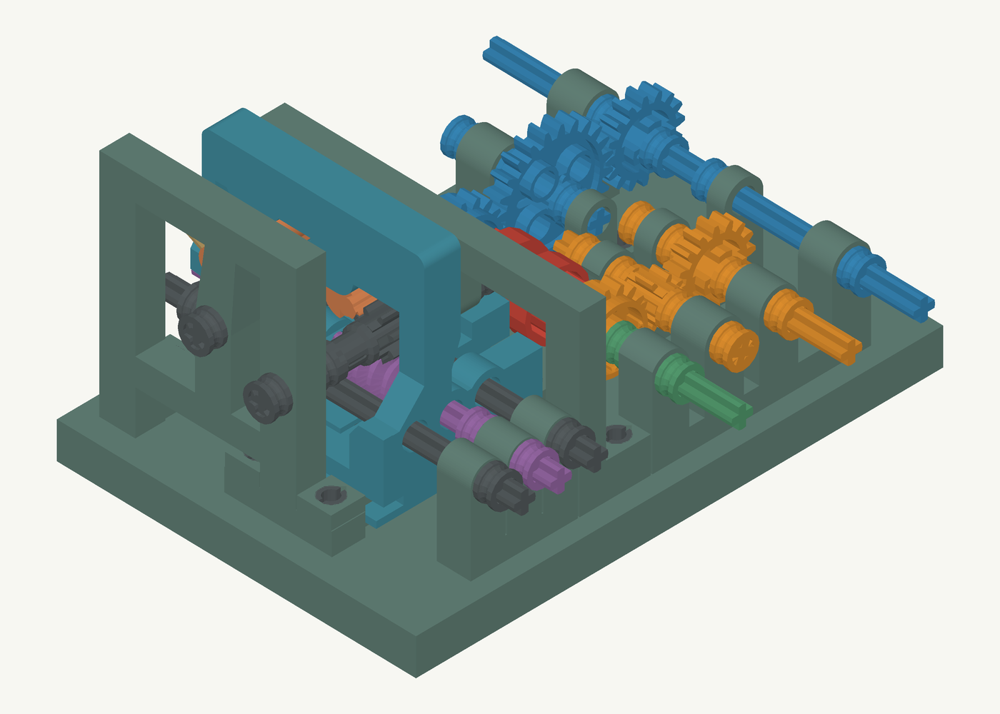

# Mechanical multiplexer

Rotation encodes the logic signals: clockwise is 0 and anticlockwise is 1. A sliding-worm actuator moves the clutch between the two input gear paths. The reaction gear and sprung lever permit overrunning at each travel endpoint; reversal drives the carriage toward the other endpoint.

## Print files

**[Complete print layout.stl](Complete%20print%20layout.stl)** contains all 13 printed components in their print orientations. Its footprint is **240.4 × 225.8 mm**, with maximum height **29.6 mm** and at least 5 mm separation between parts. Allow extra bed space for brims and supports. Print at **100% scale in millimetres**.

For individual components, use files ending in **`- print.stl`**. Other individual STLs are in assembly coordinates and are the editable component meshes. Do not print duplicate copies from both the complete layout and individual files. The supplied STLs contain no generated supports or machine instructions.

All axle bores are vertical in the print orientations. The two carriage bearing walls start directly on the bed, including their six axle-hole entrances. Some upper-frame and lever overhangs need local support; keep support interfaces out of the axle bores and off all sliding contact surfaces. Friction-pin holes may print horizontally.

The front and rear bridges lie on broad flat faces at assembly Z19.8 and Z54.8 respectively. Their main plates need no support underneath. Inspect the anchor retaining lips and horizontal pin holes in the slicer. The carriage shoe's sliding regions remain at least 1.6 mm above the bed; both fixed guides' contact regions remain at least 7.6 mm above it.

## Parts and coordinates

[LEGO parts.csv](LEGO%20parts.csv) gives the complete native part inventory. All connections between printed parts use LEGO friction pins. The band is not a LEGO mesh part; select it by physical fit and the light tension needed for reliable overrunning.

[Assembly manifest.json](Assembly%20manifest.json) records the component IDs and hardware transforms. Native positions use LDraw units (0.4 mm per unit); printed meshes use millimetres. X follows the main shafts and carriage travel, Y points toward the base, and Z follows the reaction and lever axles.

The base measures **80 × 116 × 8.2 mm**, spanning X−36 to X44 and Y28 to Y36.2. Its 25 mounting holes pass through, with nominal friction-pin tips recessed 0.2 mm from the underside. The holes allow the pins to be pushed out from below.

The left data-bearing wall at X−28 has four holes at Z−40/−24/−12/0. A separate three-hole wall supports the selector and guides at that X position. The right data-bearing wall is at X28, and the right selector/guide wall is at X26.

## Assembly

1. Seat the bearing walls, idler support and fixed guides on the base using their friction pins. Inspect through-hole exits for first-layer flare.
2. Join the two carriage parts with two LEGO 2780 friction pins. The seam is at X8, with pin centres Y−18.6/Z34 and Y19.4/Z38. The left part carries the complete sliding shoe. The lower joint includes a connecting web.
3. Fit the selector/worm and two guide axles: three 10L axles spanning X−40 to X40. Their right half-bush centres are X32. Check free carriage travel and clearance over the X26 wall.
4. Fit the data and output shafts. The blue A shaft is one 12L axle spanning X−48 to X48; the orange B shaft is one 6L axle spanning X−48 to X0. Their left A/B retainers are at X−34. The orange shaft's right end is recessed 0.4 mm into its inner half bush. The green output shaft spans X−48 to X48.
5. Fit the bridges and the 6L reaction/pivot axles, centred at Z34.4. These axles span Z10.4–58.4, ending 0.6 mm inside their outer half bushes. Retain the nominal 0.2 mm bridge-face gaps rather than clamping the rotating parts. The front reaction spacer is a full bush and the front lever spacer is a half bush; outer rear half-bush centres are Z57.
6. Fit the band in the gap between the rear bridge and carriage before finally seating the rear bridge. The fixed anchor points inward and the lever anchor has an opposing retaining head. The rear bridge integrates the bottom guide. Its foot pins are at X36, Z43/Z51; guide pins are at X−8/X8, Z51.
7. Hand-turn both directions with light band tension. Confirm clutch seating, endpoint overrunning and reversal before testing under load.

The band centre plane is Z45.5. The preview models a band 1.2 mm wide axially and 0.6 mm thick radially, with 0.3 mm nominal clearance to the retaining lips. Actual band fit and deformation need physical checks.

## Inspection and validation

Open [Viewer.html](Viewer.html) locally in a browser. Drag to rotate, Shift/right-drag to pan, and scroll to zoom. Select parts for isolation or use the carriage view. Animation follows a prescribed switching sequence; independent manual controls can create impossible combinations of travel and lever angle.

[Validation.json](Validation.json) records the 1,800-position printed-part clearance check, native hardware surface sampling, carriage bed-face checks, axle spans and all 25 base through holes. [Print checks.json](Print%20checks.json) records print orientations and plate dimensions. Individual exported parts are single watertight, consistently wound meshes. [Print file hashes.json](Print%20file%20hashes.json) identifies the STL files.

This is a geometric prototype. Pin retention, sliding friction, band behaviour, base and brace stiffness, fatigue, and reliable switching under load remain unverified physically. Inspect sliced supports and test one mechanism before scaling the design.

The retained design data consists of the assembly manifest, component meshes, inventory and self-contained viewer. No standalone parametric generator is included.
